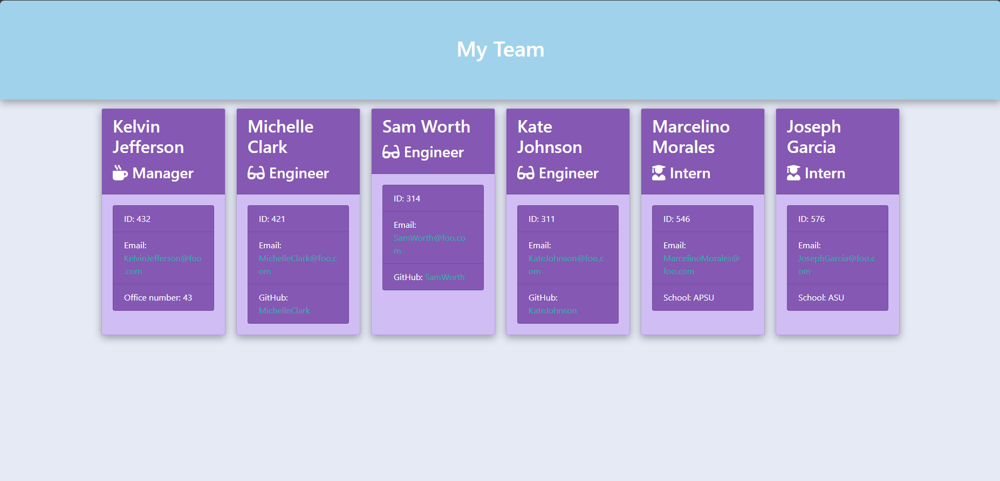

# Teamify-JS
## Transforming Team Management into a Breeze!

## Description

Teamify-JS is a Node.js command-line application designed to streamline the process of generating a webpage displaying essential information about a software engineering team 🚀. As a manager or user, you can quickly access your team members' basic details, including their emails and GitHub profiles, through an intuitive interface.

This application simplifies team management by allowing users to input information about team members directly into the command-line interface. Upon submission, the program generates an HTML webpage containing concise summaries for each team member, making it easy to keep track of crucial details at a glance. With comprehensive tests provided, you can trust that every aspect of the code meets high standards of functionality and reliability, ensuring a seamless experience for both managers and team members alike 📊. Streamline your team management process today with Teamify-JS.

Streamline your team management process today with Teamify-JS. 💼

Please see a full list of features [here](#features)

## Table of Contents

- [Dev Requirements](#dev-requirements)
- [Dev Environment Setup](#dev-environment-setup)
- [Enduser usage instructions](#end-user-usage-instructions)
- [Features](#features)
- [How to contribute](#how-to-contribute)
- [technologies ](#technologies)
- [Screenshot](#screenshot)
- [Tests](#tests)
- [Credits](#credits)
- [License](#license)

## Dev Requirements
Git/GitBash, VS Code, NodeJS, and the source code, of course! 🛠️

## Dev Environment Setup
Please make sure you have NodeJS downloaded
To get the development environment running:
1. Clone this repo
2. Navagate to the repo on your local machine
3. run `npm i` and this will install all the depencencys needed
4. run `node index.js` to run DocuGen-JS!

- `index.js`: Contains the js code to initialize and run the app
- `lib/`: Contains all javaScript class files for the employee's
- `src/`: Contains all javaScript code to allow this app to function
- `assets/images/`: Contains all images used in the project/readme
- `assets/css/`: Contains all css styles in the project

## Enduser usage instructions
Please make sure you have NodeJS downloaded

1. Clone this repo
2. Navagate to the repo on your local machine
3. run `npm i` and this will install all the depencencys needed
4. run `node index.js` to run DocuGen-JS!

## Features
- **Allows you to easily create a webpage that displays all empolyees and their roles**
- **Allows you to have quick access to their emails and GitHub profiles**

## How to contribute
1. Fork this repository
2. Clone the repository
3. Create a branch for your bug fix or feature
4. Make necessary changes and commit those changes
5. Push changes to GitHub
6. Create a pull request to this repo to submit your changes for review

## Technologies
- **JavaScript**
- **NodeJS**
- **Inquirer**
- **Jest**
- **Bootstrap**

## Screenshot

The following image shows the application's functionality:

> **Note**: This is a example of the HTML file that this app creates.

## Tests
- Run `npm run test` to run the tests

## Credits 
- **Ross** - Source Code

---

## Licence

MIT License

Copyright (c) 2024 RossNE99

Permission is hereby granted, free of charge, to any person obtaining a copy
of this software and associated documentation files (the "Software"), to deal
in the Software without restriction, including without limitation the rights
to use, copy, modify, merge, publish, distribute, sublicense, and/or sell
copies of the Software, and to permit persons to whom the Software is
furnished to do so, subject to the following conditions:

The above copyright notice and this permission notice shall be included in all
copies or substantial portions of the Software.

THE SOFTWARE IS PROVIDED "AS IS", WITHOUT WARRANTY OF ANY KIND, EXPRESS OR
IMPLIED, INCLUDING BUT NOT LIMITED TO THE WARRANTIES OF MERCHANTABILITY,
FITNESS FOR A PARTICULAR PURPOSE AND NONINFRINGEMENT. IN NO EVENT SHALL THE
AUTHORS OR COPYRIGHT HOLDERS BE LIABLE FOR ANY CLAIM, DAMAGES OR OTHER
LIABILITY, WHETHER IN AN ACTION OF CONTRACT, TORT OR OTHERWISE, ARISING FROM,
OUT OF OR IN CONNECTION WITH THE SOFTWARE OR THE USE OR OTHER DEALINGS IN THE
SOFTWARE.